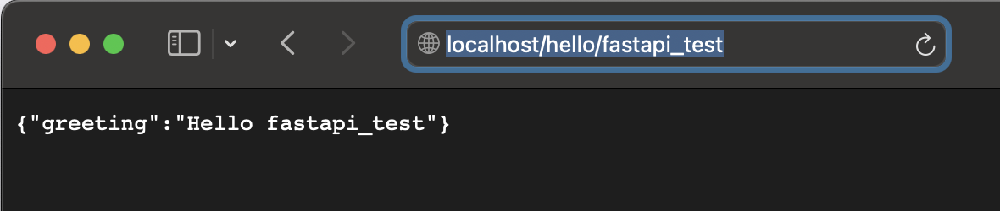

# fastapi_docker
### Run command:
```shell
docker build -t fastapi_docker .
```
### Check available images:
```shell
docker images
REPOSITORY       TAG       IMAGE ID       CREATED        SIZE
fastapi_docker   latest    72317df8f3e0   8 hours ago    1.03GB
```
### Run the service:
```shell
docker run -p 80:80 fastapi_docker
```
### Test from browser:

### Map local file to file inside Docker, change on local file will update on the running service immediately.
```shell
docker run -p 80:80 -v ./app/main.py:/code/app/main.py fastapi_docker
```